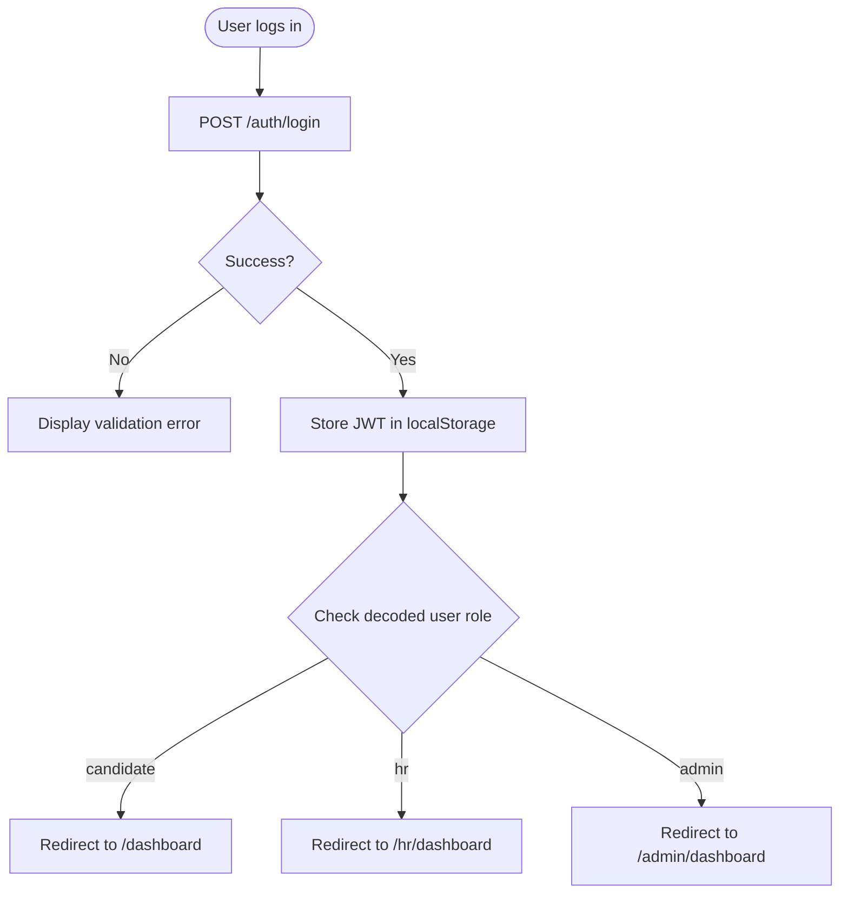

# CAPVIA Authentication Unification Plan

This document outlines the consolidation of credentials, signup, and login structures under a single source of truth: the CAPVIA API Gateway Backend.

---

## 1. Single Authentication Source
All login requests, registration submissions, password resets, and session refreshes are handled exclusively by the core FastAPI backend at:
`http://localhost:8000/api/v1/auth`

The independent logins and databases from the ATS (`ats_resume/backend`) and Simulation (`ai_simulation/backend`) frontends are deprecated. Instead:
1.  **Gateway API JWTs**: Once a user registers or logs in, they receive a JWT bearer token signed by the Gateway Core backend.
2.  **Cross-Subsystem Headers**: When the unified frontend makes requests to ATS (Port 8001) or Simulation (Port 8002) endpoints, it appends the same Gateway JWT in the `Authorization: Bearer <token>` header.
3.  **Role Verification**: Subsystem backends verify the signature and decode the user payload (id, email, role) to map attempts and records.

---

## 2. Unified Credentials Routing

We will enforce a single sign-in/registration interface located at `/auth/login` and `/auth/register`. All duplicate login components inside the old subsystem UI folders are removed.

### Role Redirect Flow:
Once a user is successfully authenticated via `POST /auth/login`, the frontend decodes their role (candidate, hr, admin) and redirects them:

---

## 3. Session Persistence & Interceptors
The unified frontend uses a single Zustand store [auth.ts](file:///Volumes/KINGSTON/CAPVIA/capvia_platform/frontend/src/store/auth.ts) to manage state.
*   **Request Interceptor**: Automatically appends the active `capvia_access_token` to all outbound Axios calls.
*   **Response Interceptor**: Intercepts `401 Unauthorized` responses and triggers the refresh token rotation (`POST /auth/refresh`) to silently update access tokens, preventing session drops mid-exam.
