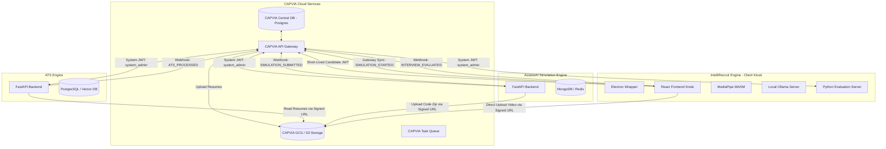

# CAPVIA Unified Integration Contract (V2)
### ATS Resume Screening, AI Coding Simulation, and AI Video Interview Engines

This document establishes the official production integration contract between the **CAPVIA Core Platform** and the three specialized AI subsystems:
1.  **CAPVIA ATS (Resume Screening & Heatmap Analyzer)**
2.  **AssessAI (Coding Simulation Platform)**
3.  **IntelliRecruit (AI Video Interview & Proctoring Engine)**

---

## 1. Unified Service Architecture

The unified recruitment workflow utilizes a sequential filtering pipeline to screen candidates at scale:

```
[Candidate Applies]
        ↓
  Stage 1: ATS Resume Screening & Skill Matching (Semantic parser + fraud detection)
        ↓  (Pass Threshold: Score >= 60%)
  Stage 2: AssessAI Coding Simulation (Interactive IDE environment + proctoring telemetry)
        ↓  (Pass Threshold: Score >= 70%)
  Stage 3: IntelliRecruit AI Video Interview (8-tier LLM questions + MediaPipe vision proctoring)
        ↓
  Stage 4: Recruiter Review & Decision (Aggregated candidate dashboard)
```

### System Topology Diagram

The diagram below details the secure communication paths, token authentications, and storage networks between the CAPVIA cloud systems, local engines, and the client kiosks.



---

## 2. Candidate & Application Lifecycle

An application transitions through the following lifecycle states, managed by CAPVIA Core:

```
[APPLIED] 
   ↓ (Auto-triggers resume upload to ATS)
[ATS_PENDING] 
   ↓ (ATS finishes processing)
[ATS_COMPLETED]
   ↓ (If ATS Score >= 60% -> Invite to Simulation)
[SIMULATION_INVITED]
   ↓ (Candidate starts simulation)
[SIMULATION_IN_PROGRESS]
   ↓ (Simulation submitted -> triggers auto-evaluation)
[SIMULATION_COMPLETED]
   ↓ (If Simulation Score >= 70% -> Invite to Video Interview)
[INTERVIEW_INVITED]
   ↓ (Candidate starts video interview)
[INTERVIEW_IN_PROGRESS]
   ↓ (Candidate finishes interview -> evaluation triggered)
[INTERVIEW_COMPLETED]
   ↓ (Scores aggregated)
[EVALUATED] or [EVALUATED_LOCAL_BASELINE] (If evaluation server was offline)
   ↓ (HR Action)
[SHORTLISTED] or [REJECTED]
```

---

## 3. Endpoint Mappings & Data Flows

The table below describes the endpoint execution mapping across the lifecycle, updated to resolve all naming mismatches:

| Sequence | Source Trigger | System | Endpoint Called | Purpose | Auth Mechanism |
| :--- | :--- | :--- | :--- | :--- | :--- |
| **1.1** | Candidate submits application | ATS | `POST /api/v1/resume/upload` | Uploads resume to start parsing. | System JWT |
| **1.2** | Resume upload completed | ATS | `POST /api/v1/internship/{jd_id}/compare/{resume_id}` | Compares resume against Job Description. | System JWT |
| **1.3** | ATS finish webhook received | CAPVIA | `GET /api/v1/internship/{jd_id}/result/{resume_id}` | Fetches final ATS score, gaps, and fraud flags. | System JWT |
| **2.1** | ATS Score >= 60% | Simulation | `POST /api/v1/system/internships/{internship_id}/register-candidate` | Registers candidate and links `external_application_uuid`. | System JWT |
| **2.2** | Candidate starts attempt | Simulation | `POST /api/v1/applications/{application_id}/start-simulation` | Allocates attempt instance, generates token, starts timer. | Candidate JWT |
| **2.2a** | Client starts simulation | CAPVIA | `POST /api/v1/gateway/applications/{application_id}/sync-attempt` | Syncs `simulation_attempt_id` generated client-side back to CAPVIA. | Candidate JWT |
| **2.3** | During simulation | Simulation | `POST /api/v1/attempts/{attempt_id}/answer` | Auto-saves task progress (code, answers, options). | Candidate JWT |
| **2.4** | During simulation | Simulation | `POST /api/v1/attempts/{attempt_id}/events` | Streams telemetry proctoring events (tab switches). | Candidate JWT |
| **2.5** | Candidate submits attempt | Simulation | `POST /api/v1/attempts/{attempt_id}/submit` | Submits coding challenge, returns taxonomy and locks session. | Candidate JWT |
| **3.1** | Sim Score >= 70% | Interview | `POST /api/v1/interview/start` | Initializes video session, triggers LLM questions, returns Signed URL for video. | System JWT |
| **3.2** | Candidate submits answer | Interview | `POST /api/v1/interview/answer` | Saves audio, text transcript, and proctoring logs per Q. | Candidate JWT |
| **3.3** | Interview finished | Interview | `POST /api/v1/interview/complete` | Concludes interview, links GCS video URL, triggers evaluation. Supports fallback baseline payload. | Candidate JWT |
| **3.4** | Recruiter Review | Interview | `GET /api/v1/interview/result/{application_id}` | Retrieves final evaluated reporting dashboard. | System JWT |

---

## 4. Request/Response Transformations

### 4.1. ATS Comparison to Simulation Registration
When a candidate qualifies for the coding simulation, CAPVIA extracts the candidate data and matching skills from the ATS response and registers the application in AssessAI.

* **ATS Source Output (`GET /api/v1/internship/{jd_id}/result/{resume_id}`)**:
  ```json
  {
    "resume_id": "b78b663b-64ee-48ba-b7e5-1a2eb75b0726",
    "overall_score": 82.5,
    "required_skills_analysis": {
      "matches": [
        { "target": "Python", "match": "Python", "score": 1.0 },
        { "target": "SQL", "match": "SQL", "score": 1.0 }
      ]
    }
  }
  ```
* **AssessAI Target Input (`POST /api/v1/system/internships/{internship_id}/register-candidate`)**:
  ```json
  {
    "external_application_uuid": "c1a2b3c4-d5e6-7f8a-9b0c-1d2e3f4a5b6c",
    "external_candidate_uuid": "u9f8e7d6-c5b4-a3f2-e1d0-c9b8a7f6e5d4",
    "email": "candidate@example.com",
    "full_name": "Arjun Kumar",
    "skills_from_resume": ["Python", "SQL"]
  }
  ```
* **AssessAI Registration Response**:
  ```json
  {
    "simulation_candidate_id": 2510,
    "simulation_application_id": 9841
  }
  ```

### 4.2. Simulation Completion to Interview Initialization
Upon successful simulation completion, CAPVIA initializes the video interview, extracting the target role classified by the simulation and forwarding the required skills to configure Ollama's question generation.

* **AssessAI Source Output (`POST /api/v1/attempts/{attempt_id}/submit`)**:
  ```json
  {
    "attempt_id": 42,
    "status": "submitted",
    "total_score": 85.5,
    "role_name": "Backend Developer",
    "skills_assessed": ["Python", "FastAPI", "Database Indexing"],
    "cheating_risk_level": "LOW",
    "recommendation": "hire"
  }
  ```
* **IntelliRecruit Target Input (`POST /api/v1/interview/start`)**:
  ```json
  {
    "application_id": "c1a2b3c4-d5e6-7f8a-9b0c-1d2e3f4a5b6c",
    "candidate_id": "u9f8e7d6-c5b4-a3f2-e1d0-c9b8a7f6e5d4",
    "candidate_name": "Arjun Kumar",
    "job_role": "Backend Developer",
    "skills": ["Python", "FastAPI", "Database Indexing"],
    "company_name": "Capvia AI"
  }
  ```

---

## 5. Webhook Registration & Payload Specifications

Subsystems notify CAPVIA Core asynchronously using webhooks. Webhooks are configured via dynamic registration endpoints or shared environment variables.

### 5.1. Dynamic Webhook Registration
Each subsystem exposes a dynamic webhook configuration API to allow CAPVIA Core to establish endpoints and rotate signing secrets:
* **Endpoint**: `POST /api/v1/webhooks/configure`
* **Request Schema**:
  ```json
  {
    "webhook_url": "https://api.capvia.com/gateway/webhooks",
    "signing_secret": "whsec_prod_xxxxxxxxxxxxxxxxxxxxxxxx",
    "events": ["ATS_PROCESSED", "SIMULATION_SUBMITTED", "INTERVIEW_EVALUATED"]
  }
  ```

### 5.2. Webhook Signature Verification
All webhooks include an `X-CAPVIA-Signature` header computed as an HMAC-SHA256 signature over the webhook payload concatenated with an epoch timestamp to prevent replay attacks:

$$\text{Signature} = \text{HMAC-SHA256}(\text{signing\_secret}, t \mathbin{\Vert} \text{PayloadBody})$$

*   **Header Format**: `X-CAPVIA-Signature: t=177112090,v1=5d41402abc4b2a76b9719d911017c592`
*   **Time Tolerance**: CAPVIA Core will reject webhooks if $| \text{current\_time} - t | > 300\text{ seconds}$.

---

### 5.3. Webhook Payloads

#### 5.3.1. ATS Processing Completed (`ATS_PROCESSED`)
Fired when the resume processing pipeline has completed parsing, vector indexing, and Job Description comparison.
* **Payload**:
  ```json
  {
    "event": "ATS_PROCESSED",
    "timestamp": "2026-06-16T12:00:25Z",
    "data": {
      "application_id": "c1a2b3c4-d5e6-7f8a-9b0c-1d2e3f4a5b6c",
      "resume_id": "b78b663b-64ee-48ba-b7e5-1a2eb75b0726",
      "jd_id": "e9324d67-8bfd-46d5-a83f-8012e1ff9e2b",
      "status": "SUCCESS",
      "overall_ats_score": 82.5,
      "score_band": "GOOD",
      "is_suspicious": false
    }
  }
  ```

#### 5.3.2. Simulation Submitted (`SIMULATION_SUBMITTED`)
Fired when the candidate submits their coding simulation attempt. Uses the linked `application_id` stored during system registration.
* **Payload**:
  ```json
  {
    "event": "SIMULATION_SUBMITTED",
    "timestamp": "2026-06-16T15:30:00Z",
    "data": {
      "application_id": "c1a2b3c4-d5e6-7f8a-9b0c-1d2e3f4a5b6c",
      "attempt_id": 42,
      "total_score": 85.5,
      "cheating_risk_level": "LOW",
      "ai_dependency_score": 0.12,
      "recommendation": "hire"
    }
  }
  ```

#### 5.3.3. Video Interview Scored (`INTERVIEW_EVALUATED`)
Fired when the audio transcripts have been evaluated and the video file has been proctored. **Standardized naming conventions used to prevent type/name mismatches.**
* **Payload**:
  ```json
  {
    "event": "INTERVIEW_EVALUATED",
    "timestamp": "2026-06-16T18:21:15Z",
    "data": {
      "application_id": "c1a2b3c4-d5e6-7f8a-9b0c-1d2e3f4a5b6c",
      "session_id": "s8r7q6p5-o4n3-m2l1-k0j9-i8h7g6f5e4d3",
      "overall_answer_score_pct": 78,
      "overall_integrity_score": 88,
      "cheating_probability_pct": 12,
      "risk_level": "LOW",
      "recommendation": "Strong Hire",
      "video_url": "https://storage.googleapis.com/capvia-interview-videos/s8r7q6p5.webm"
    }
  }
  ```

---

## 6. Unified Database Schema Mapping (PostgreSQL Compatible)

To trace candidate progress across engines without data drift or duplicate schemas, CAPVIA uses three mapping tables with proper triggers.

```
                  ┌──────────────────┐
                  │   applications   │
                  │  (CAPVIA Core)   │
                  └────────┬─────────┘
                           │ (1:1)
         ┌─────────────────┼─────────────────┐
         │ (1:1)           │ (1:1)           │ (1:1)
┌────────▼────────┐┌───────▼────────┐┌───────▼────────┐
│candidate_mapp...││ vacancy_mapp...││applicat_mapp...│
└─────────────────┘└────────────────┘└────────────────┘
```

### 6.1. Candidate Mapping Schema (`candidate_mappings`)
Maps CAPVIA's Candidate UUID to subsystem user/candidate IDs.
```sql
CREATE TABLE candidate_mappings (
    mapping_id UUID PRIMARY KEY DEFAULT gen_random_uuid(),
    capvia_candidate_uuid UUID NOT NULL UNIQUE,
    ats_user_uuid UUID UNIQUE,
    simulation_candidate_id INTEGER UNIQUE, -- Maps to AssessAI User ID
    interview_candidate_uuid UUID UNIQUE,
    created_at TIMESTAMP WITH TIME ZONE DEFAULT CURRENT_TIMESTAMP,
    updated_at TIMESTAMP WITH TIME ZONE DEFAULT CURRENT_TIMESTAMP
);
CREATE INDEX idx_candidate_mappings_capvia ON candidate_mappings(capvia_candidate_uuid);
```

### 6.2. Vacancy Mapping Schema (`vacancy_mappings`)
Maps CAPVIA's Vacancy UUID to subsystem Job/Internship IDs.
```sql
CREATE TABLE vacancy_mappings (
    mapping_id UUID PRIMARY KEY DEFAULT gen_random_uuid(),
    capvia_vacancy_uuid UUID NOT NULL UNIQUE,
    ats_jd_uuid UUID UNIQUE,
    simulation_internship_id INTEGER UNIQUE, -- Maps to AssessAI Internship ID
    created_at TIMESTAMP WITH TIME ZONE DEFAULT CURRENT_TIMESTAMP,
    updated_at TIMESTAMP WITH TIME ZONE DEFAULT CURRENT_TIMESTAMP
);
CREATE INDEX idx_vacancy_mappings_capvia ON vacancy_mappings(capvia_vacancy_uuid);
```

### 6.3. Application Mapping Schema (`application_mappings`)
Maps the unique database keys of the subsystems back to a central `applications` entity and caches aggregate scoring records.
```sql
CREATE TABLE application_mappings (
    mapping_id UUID PRIMARY KEY DEFAULT gen_random_uuid(),
    application_id UUID NOT NULL UNIQUE REFERENCES applications(id) ON DELETE CASCADE,
    
    -- Subsystem Foreign Keys
    ats_resume_uuid UUID UNIQUE,
    simulation_attempt_id INTEGER UNIQUE,
    simulation_application_id INTEGER UNIQUE,
    interview_session_uuid UUID UNIQUE,
    
    -- Aggregated Score Cache (For recruiter dashboard)
    ats_score NUMERIC(5, 2),
    simulation_score NUMERIC(5, 2),
    interview_answer_score_pct INTEGER,
    interview_integrity_score INTEGER,
    combined_risk_level VARCHAR(20) DEFAULT 'LOW',
    
    created_at TIMESTAMP WITH TIME ZONE DEFAULT CURRENT_TIMESTAMP,
    updated_at TIMESTAMP WITH TIME ZONE DEFAULT CURRENT_TIMESTAMP
);
CREATE INDEX idx_application_mappings_app ON application_mappings(application_id);
```

### 6.4. PostgreSQL Trigger Automation
To avoid the MySQL syntax error, automated timestamps are handled via plpgsql triggers:
```sql
-- Trigger Function
CREATE OR REPLACE FUNCTION update_updated_at_column()
RETURNS TRIGGER AS $$
BEGIN
    NEW.updated_at = CURRENT_TIMESTAMP;
    RETURN NEW;
END;
$$ language 'plpgsql';

-- Trigger Bindings
CREATE TRIGGER trigger_update_candidate_mappings
    BEFORE UPDATE ON candidate_mappings
    FOR EACH ROW EXECUTE FUNCTION update_updated_at_column();

CREATE TRIGGER trigger_update_vacancy_mappings
    BEFORE UPDATE ON vacancy_mappings
    FOR EACH ROW EXECUTE FUNCTION update_updated_at_column();

CREATE TRIGGER trigger_update_application_mappings
    BEFORE UPDATE ON application_mappings
    FOR EACH ROW EXECUTE FUNCTION update_updated_at_column();
```

---

## 7. Authentication & Security Strategy

Authentication uses short-lived tokens and cryptographic checks to enforce security boundaries without exposing private variables.

### 7.1. Service-to-Service Requests (System JWT)
CAPVIA Gateway signs outbound requests to the ATS and Simulation backends using a secure JWT token.
* **Header**: `Authorization: Bearer <JWT>`
* **Claims**:
  - `iss`: `"CAPVIA_CORE"`
  - `aud`: `"ATS_ENGINE"` | `"ASSESS_AI"` | `"INTELLIRECRUIT_ENGINE"`
  - `exp`: Short expiration (e.g., 300 seconds)
  - `roles`: `["system_admin"]`
* **Validation**: The subsystems must verify the signature using CAPVIA's shared key or public keys and explicitly accept `"system_admin"` to bypass standard student/hr user role gates.

### 7.2. Candidate-Facing Kiosk Requests (Kiosk JWT)
Client-facing kiosk apps running inside the candidate's browser or local Electron app **must not utilize static master API keys**. 
Instead, CAPVIA Core Gateway generates a short-lived **Kiosk JWT** upon invite:
* **Claims**:
  - `iss`: `"CAPVIA_CORE"`
  - `sub`: Candidate UUID (e.g., `u9f8e7d6-c5b4-a3f2-e1d0-c9b8a7f6e5d4`)
  - `aud`: `"INTELLIRECRUIT_ENGINE"` | `"ASSESS_AI"`
  - `exp`: Session specific expiry time (e.g., 2 hours)
  - `application_id`: The CAPVIA application UUID.
* **Validation**: Kiosk engines verify the JWT and enforce boundary checks. The candidate only has access to endpoints for their specific active `application_id` and matching `session_id`/`attempt_id`.

---

## 8. Failure Modes, Retries & Fallbacks

### 8.1. API Call Retries (Exponential Backoff with Jitter)
If calls to ATS, Simulation, or Interview engines encounter transient network errors (`502`, `503`, or timeouts), CAPVIA Core will retry using exponential backoff with jitter:

$$T_{\text{wait}} = 2^{\text{attempt}} \times \text{BaseDelay} \pm \text{RandomJitter}$$

*   **Configuration**: Max Retries = `5`, Base Delay = `2 seconds`, Jitter = `±500ms`.

### 8.2. Webhook Delivery Failures & Dead Letter Queue (DLQ)
* Subsystems will retry sending webhooks to CAPVIA Core Gateway up to `8` times using exponential backoff over `24 hours`.
* If a webhook fails after `8` retries, it is written to the subsystem's **Dead Letter Queue (DLQ)**. 
* CAPVIA Core runs a reconciliation task every `1 hour` that polls `/api/v1/webhooks/reconcile` on the subsystems to pull any failed events.

### 8.3. Subsystem Failure Modes & Fallbacks

| Failure Scenario | Impact | Fallback Procedure |
| :--- | :--- | :--- |
| **Local Ollama Daemon Offline** | Dynamic questions cannot be generated. | Kiosk automatically falls back to the smart question template bank (`localQuestionAI.ts`), generating role-specific questions from cached pools. |
| **Proctoring Server Offline (Port 5001)** | AI Cheating risk model (LSTM/YOLO) is unreachable. | The React frontend switches to browser-native proctoring mode. MediaPipe FaceMesh WASM calculates eye/head pose client-side. The session remains proctored without interruption. |
| **Evaluation Server Offline (Port 8765)** | `/evaluate` (S-BERT) fails during concluding phase. | The client applies client-side JavaScript scoring logic (`speechEvaluationService.ts` + `deepEvaluationService.ts`) to generate a baseline. The client calls `/interview/complete` passing the `baselined_locally` flag and the `local_evaluation_report_json` payload. CAPVIA Core saves this as a baseline and queues the session for server-side evaluation once the server recovers. |
| **Video Upload Timeout (Large WebM payloads)** | Complete session recording fails to save. | The client saves the video chunk history in IndexedDB. When network quality recovers, the kiosk triggers a background upload agent to upload the recording to the GCS bucket. |

#### 8.3.1. Modified Interview Completion Schema with Fallback (`POST /api/v1/interview/complete`)
Enables the client to send evaluation results when evaluation servers are offline:
* **Content-Type**: `multipart/form-data`
* **Fields**:
  - `session_id` (string, required)
  - `video_url` (string, required) - Direct cloud storage URL
  - `local_violations_json` (string, required)
  - `baselined_locally` (boolean, optional) - Set to `true` during evaluation server outages
  - `local_evaluation_report_json` (string, optional) - Serialized client-side scores output
