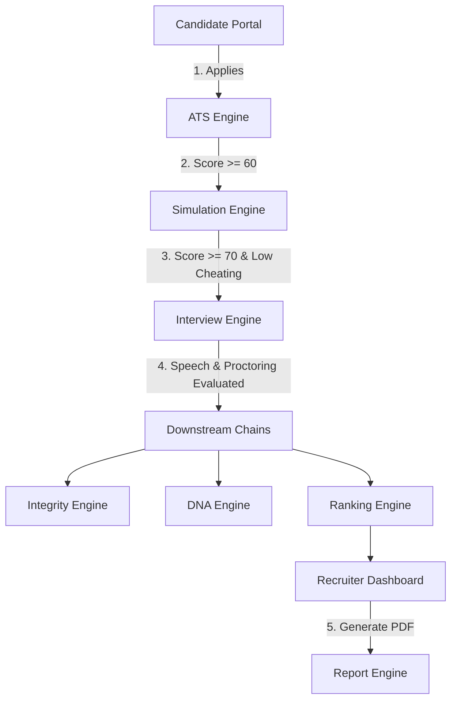

# CAPVIA Recruitment Platform

CAPVIA is an enterprise-grade AI-powered recruiting and candidate assessment ecosystem. By replacing traditional manual resume screening and non-proctored coding tasks with an integrated funnel of resume matching, interactive coding simulations, video-integrity interviews, and 9-dimensional capability DNA profiling, CAPVIA delivers a cheating-resistant composite leaderboard. Recruiter dashboards compile final applicant rankings and compile comprehensive, version-controlled PDF dossiers containing candidate strengths, weaknesses, and hiring recommendations.

---

## 1. Ecosystem Overview

CAPVIA coordinates candidate evaluation across the following core engines:



---

## 2. Key Features

- **ATS Resume Parsing**: Eagerly extracts text and compares alignments using semantic matching.
- **Coding Simulation (AssessAI)**: Implements coding environments, score calculations, and copy-paste tab-switch proctoring.
- **Video Interview (IntelliRecruit)**: AI speech processing and facial proctoring indicators.
- **Integrity Engine**: Evaluates focused state, look-away anomalies, browser manipulation, and outputs a consolidated **Trust Index**.
- **DNA Profile Engine**: Maps candidate capability along 9 core dimensions (Problem Solving, Execution, Learning Ability, etc.).
- **Ranking Engine**: Computes a weighted leaderboard score using a 25/30/25/20 formula.
- **Recruiter Dashboard**: Complete platform for filtering applicants, radar comparisons, funnel analytics, and downloading PDF dossiers.
- **Candidate Portal**: Job listings, profile details, application progress stepper, and feedback insights.
- **Report Engine**: Automatic compilation, versioning, and download auditing of PDF recruitment reports.

---

## 3. Technology Stack

### Backend Core
- **FastAPI**: Asynchronous Python API gateway.
- **SQLAlchemy (Async)**: ORM layer utilizing `asyncpg` with PostgreSQL.
- **Alembic**: Database schema migration controller.
- **Redis**: Asynchronous queue processing and temporary token/refresh session caching.
- **ReportLab**: Programmatic PDF compilation canvas.

### Frontend Portals
- **Next.js 14**: Server-rendered React frontend.
- **TypeScript**: Static typing safety.
- **TailwindCSS**: Premium responsive UI.
- **React Query & Zustand**: Server-state synchronization and client state store.

### External Subsystems (Mocked Interfaces)
- **ATS Subsystem**: MongoDB backed parser.
- **AssessAI Simulation**: Dockerized workspace environment.
- **IntelliRecruit Video Interview**: Electron client and Python ML inference server.

---

## 4. Folder Structure

```
CAPVIA/
├── capvia_platform/                # Core CAPVIA Gateway & HR Portal
│   ├── api/                        # Custom middleware and dependency scopes
│   ├── core/                       # App config, security modules, JWT keys
│   ├── database/                   # Connection sessions and engine setups
│   ├── frontend/                   # Next.js 14 recruiter & candidate dashboard
│   ├── models/                     # SQLAlchemy declarative model entities
│   ├── repositories/               # Async repository query classes
│   ├── routers/                    # Endpoint routers (auth, applications, reports, etc.)
│   ├── services/                   # Business logic (integrity, DNA, ranking, reports)
│   ├── tasks/                      # Background task loop workers
│   └── tests/                      # Pytest integration files
├── ats_resume/                     # Mock ATS Resume parser service
├── ai_simulation/                  # Mock AssessAI Coding Simulation service
├── ai_interview/                   # Mock IntelliRecruit Video Interview service
├── docs/                           # OpenAPI specifications and agreements
├── storage/                        # Generated PDF dossiers
└── README.md                       # Main workspace readme
```

---

## 5. Application Stepper Lifecycle

Candidates transition sequentially through the following state machine:

1. **APPLIED**: Application created; cover letter and resume uploaded.
2. **ATS_PENDING**: Queued for semantic resume screening.
3. **ATS_COMPLETED**: Resume evaluated; candidate proceeds if score $\ge$ 60%.
4. **SIMULATION_INVITED**: Invitation token generated and emailed.
5. **SIMULATION_IN_PROGRESS**: Candidate has started the AssessAI workspace session.
6. **SIMULATION_COMPLETED**: Coding task submitted; candidate proceeds if score $\ge$ 70% and cheating risk is not Critical.
7. **INTERVIEW_INVITED**: IntelliRecruit video interview token generated.
8. **INTERVIEW_IN_PROGRESS**: Candidate in active video Q&A session.
9. **INTERVIEW_COMPLETED**: Interview submitted; video uploaded.
10. **EVALUATED**: Downstream engines process and evaluate scores.
11. **SHORTLISTED**: Recruiter adds applicant to hiring shortlist.
12. **HIRED**: Placement complete; notifications dispatched.

---

## 6. Master Documentation Index

For exhaustive operating manual guides, refer to:

- **[SETUP_GUIDE.md](file:///Volumes/KINGSTON/CAPVIA/docs/manuals/SETUP_GUIDE.md)**: Clean machine setup guide for developers.
- **[LOCAL_DEVELOPMENT_GUIDE.md](file:///Volumes/KINGSTON/CAPVIA/docs/manuals/LOCAL_DEVELOPMENT_GUIDE.md)**: Daily developer runbook and command workflows.
- **[SYSTEM_ARCHITECTURE.md](file:///Volumes/KINGSTON/CAPVIA/docs/manuals/SYSTEM_ARCHITECTURE.md)**: Detailed system layout, sequence diagrams, and webhooks.
- **[DATABASE_GUIDE.md](file:///Volumes/KINGSTON/CAPVIA/docs/manuals/DATABASE_GUIDE.md)**: ERD, table mappings, foreign keys, and backup rules.
- **[API_DOCUMENTATION.md](file:///Volumes/KINGSTON/CAPVIA/docs/manuals/API_DOCUMENTATION.md)**: REST endpoints payload structures and validations.
- **[INTEGRATION_GUIDE.md](file:///Volumes/KINGSTON/CAPVIA/docs/manuals/INTEGRATION_GUIDE.md)**: Subsystem integration contracts and resilience configurations.
- **[TESTING_GUIDE.md](file:///Volumes/KINGSTON/CAPVIA/docs/manuals/TESTING_GUIDE.md)**: Pytest manuals, code coverage, and verification.
- **[DEPLOYMENT_GUIDE.md](file:///Volumes/KINGSTON/CAPVIA/docs/manuals/DEPLOYMENT_GUIDE.md)**: Production infrastructure setup and dockerization.
- **[TROUBLESHOOTING_GUIDE.md](file:///Volumes/KINGSTON/CAPVIA/docs/manuals/TROUBLESHOOTING_GUIDE.md)**: Runbook for logs, service restarts, and engine errors.
- **[SECURITY_GUIDE.md](file:///Volumes/KINGSTON/CAPVIA/docs/manuals/SECURITY_GUIDE.md)**: RBAC definitions, JWT security, HMAC keys, and data encryption.
- **[OPERATIONS_RUNBOOK.md](file:///Volumes/KINGSTON/CAPVIA/docs/manuals/OPERATIONS_RUNBOOK.md)**: Cron maintenance tasks and backup routines.
- **[CAPVIA_FOUNDER_MANUAL.md](file:///Volumes/KINGSTON/CAPVIA/docs/manuals/CAPVIA_FOUNDER_MANUAL.md)**: Product pitch, business demo scripts, and recruitment onboarding playbooks.
