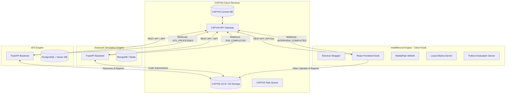

# CAPVIA Unified Integration Contract
### ATS Resume Screening, AI Coding Simulation, and AI Video Interview Engines

This document establishes the official production integration contract between the **CAPVIA Core Platform** and the three specialized AI subsystems:
1.  **CAPVIA ATS (Resume Screening & Heatmap Analyzer)**
2.  **AssessAI (Coding Simulation Platform)**
3.  **IntelliRecruit (AI Video Interview & Proctoring Engine)**

---

## 1. Unified Service Architecture

The unified recruitment workflow utilizes a sequential filtering pipeline to screen candidates at scale:

```
[Candidate Applies]
        ↓
  Stage 1: ATS Resume Screening & Skill Matching (Semantic parser + fraud detection)
        ↓  (Pass Threshold: Score >= 60%)
  Stage 2: AssessAI Coding Simulation (Interactive IDE environment + proctoring telemetry)
        ↓  (Pass Threshold: Score >= 70%)
  Stage 3: IntelliRecruit AI Video Interview (8-tier LLM questions + MediaPipe vision proctoring)
        ↓
  Stage 4: Recruiter Review & Decision (Aggregated candidate dashboard)
```

### System Topology Diagram

The diagram below details the communication paths and storage networks between the CAPVIA cloud systems and the local engines.



---

## 2. Candidate & Application Lifecycle

An application transitions through the following lifecycle states, managed by CAPVIA Core:

```
[APPLIED] 
   ↓ (Auto-triggers resume upload to ATS)
[ATS_PENDING] 
   ↓ (ATS finishes processing)
[ATS_COMPLETED]
   ↓ (If ATS Score >= 60% -> Invite to Simulation)
[SIMULATION_INVITED]
   ↓ (Candidate starts simulation)
[SIMULATION_IN_PROGRESS]
   ↓ (Simulation submitted -> triggers auto-evaluation)
[SIMULATION_COMPLETED]
   ↓ (If Simulation Score >= 70% -> Invite to Video Interview)
[INTERVIEW_INVITED]
   ↓ (Candidate starts video interview)
[INTERVIEW_IN_PROGRESS]
   ↓ (Candidate finishes interview -> evaluation triggered)
[INTERVIEW_COMPLETED]
   ↓ (Scores aggregated)
[EVALUATED] 
   ↓ (HR Action)
[SHORTLISTED] or [REJECTED]
```

---

## 3. Endpoint Mappings & Data Flows

The table below describes the endpoint execution mapping across the lifecycle:

| Sequence | Source Trigger | System | Endpoint Called | Purpose |
| :--- | :--- | :--- | :--- | :--- |
| **1.1** | Candidate submits application | ATS | `POST /api/v1/resume/upload` | Uploads resume PDF/DOCX to start parsing. |
| **1.2** | Resume upload completed | ATS | `POST /api/v1/internship/{jd_id}/compare/{resume_id}` | Compares resume contents against the Job Description. |
| **1.3** | ATS finish webhook received | CAPVIA | `GET /api/v1/internship/{jd_id}/result/{resume_id}` | Fetches final ATS score, missing skills, and fraud flags. |
| **2.1** | ATS Score >= 60% | Simulation | `POST /api/v1/internships/{internship_id}/apply` | Registers candidate in the coding simulation module. |
| **2.2** | Candidate starts attempt | Simulation | `POST /api/v1/applications/{app_id}/start-simulation` | Allocates attempt instance, generates token, starts timer. |
| **2.3** | During simulation | Simulation | `POST /api/v1/attempts/{attempt_id}/answer` | Auto-saves task progress (code, answers, options). |
| **2.4** | During simulation | Simulation | `POST /api/v1/attempts/{attempt_id}/events` | Streams telemetry proctoring events (tab switches). |
| **2.5** | Candidate submits attempt | Simulation | `POST /api/v1/attempts/{attempt_id}/submit` | Submits coding challenge and locks the session. |
| **3.1** | Sim Score >= 70% | Interview | `POST /api/v1/interview/start` | Initializes video session and requests LLM questions. |
| **3.2** | Candidate submits answer | Interview | `POST /api/v1/interview/answer` | Saves audio, text transcript, and proctoring logs per Q. |
| **3.3** | Interview finished | Interview | `POST /api/v1/interview/complete` | Concludes interview, saves WebM video, starts scoring. |
| **3.4** | Recruiter Review | Interview | `GET /api/v1/interview/result/{application_id}` | Retrieves final evaluated reporting dashboard. |

---

## 4. Request/Response Transformations

### 4.1. ATS Comparison to Simulation Registration
When a candidate qualifies for the coding simulation, CAPVIA extracts the candidate data and matching skills from the ATS response and registers the application in AssessAI.

* **ATS Source Output (`GET /api/v1/internship/{jd_id}/result/{resume_id}`)**:
  ```json
  {
    "resume_id": "b78b663b-64ee-48ba-b7e5-1a2eb75b0726",
    "overall_score": 82.5,
    "required_skills_analysis": {
      "matches": [
        { "target": "Python", "match": "Python", "score": 1.0 },
        { "target": "SQL", "match": "SQL", "score": 1.0 }
      ]
    }
  }
  ```
* **AssessAI Target Input (`POST /api/v1/internships/{internship_id}/apply`)**:
  ```json
  {
    "candidate_id": 2510,
    "email": "candidate@example.com",
    "full_name": "Arjun Kumar",
    "skills_from_resume": ["Python", "SQL"]
  }
  ```

### 4.2. Simulation Completion to Interview Initialization
Upon successful simulation completion, CAPVIA initializes the video interview, extracting the target role classified by the simulation and forwarding the required skills to configure Ollama's question generation.

* **AssessAI Source Output (`POST /api/v1/attempts/{attempt_id}/submit`)**:
  ```json
  {
    "attempt_id": 42,
    "status": "submitted",
    "total_score": 85.5,
    "role_name": "Backend Developer",
    "skills_assessed": ["Python", "FastAPI", "Database Indexing"]
  }
  ```
* **IntelliRecruit Target Input (`POST /api/v1/interview/start`)**:
  ```json
  {
    "application_id": "c1a2b3c4-d5e6-7f8a-9b0c-1d2e3f4a5b6c",
    "candidate_id": "u9f8e7d6-c5b4-a3f2-e1d0-c9b8a7f6e5d4",
    "candidate_name": "Arjun Kumar",
    "job_role": "Backend Developer",
    "skills": ["Python", "FastAPI", "Database Indexing"],
    "company_name": "Capvia AI"
  }
  ```

---

## 5. Webhook Flows

Subsystems notify CAPVIA Core asynchronously using webhooks. Webhooks include an `X-CAPVIA-Signature` header for authentication.

### 5.1. ATS Processing Completed (`ATS_PROCESSED`)
Fired when the resume processing pipeline has completed parsing, vector indexing, and Job Description comparison.

* **Payload**:
  ```json
  {
    "event": "ATS_PROCESSED",
    "timestamp": "2026-06-16T12:00:25Z",
    "data": {
      "application_id": "c1a2b3c4-d5e6-7f8a-9b0c-1d2e3f4a5b6c",
      "resume_id": "b78b663b-64ee-48ba-b7e5-1a2eb75b0726",
      "jd_id": "e9324d67-8bfd-46d5-a83f-8012e1ff9e2b",
      "status": "SUCCESS",
      "overall_ats_score": 82.5,
      "score_band": "GOOD",
      "is_suspicious": false
    }
  }
  ```

### 5.2. Simulation Submitted (`SIMULATION_SUBMITTED`)
Fired when the candidate submits their coding simulation.

* **Payload**:
  ```json
  {
    "event": "SIMULATION_SUBMITTED",
    "timestamp": "2026-06-16T15:30:00Z",
    "data": {
      "application_id": "c1a2b3c4-d5e6-7f8a-9b0c-1d2e3f4a5b6c",
      "attempt_id": 42,
      "total_score": 85.5,
      "cheating_risk_level": "LOW",
      "ai_dependency_score": 0.12,
      "recommendation": "hire"
    }
  }
  ```

### 5.3. Video Interview Scored (`INTERVIEW_EVALUATED`)
Fired when the audio transcripts have been evaluated and the video file has been proctored.

* **Payload**:
  ```json
  {
    "event": "INTERVIEW_EVALUATED",
    "timestamp": "2026-06-16T18:21:15Z",
    "data": {
      "application_id": "c1a2b3c4-d5e6-7f8a-9b0c-1d2e3f4a5b6c",
      "session_id": "s8r7q6p5-o4n3-m2l1-k0j9-i8h7g6f5e4d3",
      "overall_answer_score": 78.0,
      "overall_integrity_score": 88.0,
      "cheating_probability": 12.0,
      "risk_level": "LOW",
      "recommendation": "Strong Hire",
      "video_url": "https://storage.googleapis.com/capvia-interview-videos/s8r7q6p5.webm"
    }
  }
  ```

---

## 6. Unified Database Schema Mapping

To trace candidate progress, CAPVIA maps the unique database keys of the subsystems back to a central `applications` entity.

```
                  ┌──────────────────┐
                  │   applications   │
                  │  (CAPVIA Core)   │
                  └────────┬─────────┘
                           │ (1:1)
         ┌─────────────────┼─────────────────┐
         │ (1:1)           │ (1:1)           │ (1:1)
┌────────▼────────┐┌───────▼────────┐┌───────▼────────┐
│  resumes (ATS)  ││attempts (Assess)││ sessions (IR)  │
└─────────────────┘└────────────────┘└────────────────┘
```

### 6.1. CAPVIA Central Application Entity (`applications`)
*   `id` (UUID, Primary Key)
*   `candidate_id` (UUID, Foreign Key)
*   `vacancy_id` (UUID, Foreign Key)
*   `status` (VARCHAR) — `APPLIED`, `SIMULATION_COMPLETED`, etc.
*   `current_stage` (VARCHAR) — `ATS`, `SIMULATION`, `INTERVIEW`
*   `ats_resume_id` (UUID, Nullable) — Reference to ATS resume table
*   `simulation_attempt_id` (INTEGER, Nullable) — Reference to AssessAI attempt table
*   `interview_session_id` (UUID, Nullable) — Reference to IntelliRecruit session table
*   `created_at` (TIMESTAMP)

### 6.2. Mapping Association Schema

```sql
CREATE TABLE application_mappings (
    mapping_id UUID PRIMARY KEY DEFAULT gen_random_uuid(),
    application_id UUID NOT NULL REFERENCES applications(id) ON DELETE CASCADE,
    
    -- Subsystem Foreign Keys
    ats_resume_uuid UUID UNIQUE,
    simulation_attempt_id INTEGER UNIQUE,
    interview_session_uuid UUID UNIQUE,
    
    -- Aggregated Score Cache (For recruiters dashboard)
    ats_score NUMERIC(5, 2),
    simulation_score NUMERIC(5, 2),
    interview_answer_score NUMERIC(5, 2),
    interview_integrity_score NUMERIC(5, 2),
    combined_risk_level VARCHAR(20) DEFAULT 'LOW',
    
    updated_at TIMESTAMP DEFAULT CURRENT_TIMESTAMP ON UPDATE CURRENT_TIMESTAMP
);

CREATE INDEX idx_mappings_app ON application_mappings(application_id);
```

---

## 7. Authentication & Security Strategy

Authentication uses JWT Bearer exchanges and HMAC signature validations to secure transactions between CAPVIA and the subsystems.

### 7.1. Service-to-Service Requests
CAPVIA Gateway signs outbound requests to the ATS and Simulation backends using a secure JWT token containing:
- `iss`: `"CAPVIA_CORE"`
- `aud`: `"ATS_ENGINE"` | `"ASSESS_AI"`
- `exp`: Short expiration (e.g., 5 minutes)
- `roles`: `["system_admin"]`

Inbound requests from candidate-facing kiosk systems use an API key validation schema:
- Header: `X-CAPVIA-API-Key: capvia_live_xxxxxxxx`

### 7.2. Webhook Signature Verification
To prevent spoofing, webhooks include an HMAC signature in the header computed using SHA-256 over the raw JSON payload with a shared secret.

$$\text{Signature} = \text{HMAC-SHA256}(\text{SharedSecret}, \text{PayloadBody})$$

*   **Verification Header**: `X-CAPVIA-Signature: t=177112090,v1=5d41402abc4b2a76b9719d911017c592`

---

## 8. Failure Modes, Retries & Fallbacks

Reliability strategies are established for the following integration failure modes:

### 8.1. API Call Retries (Exponential Backoff with Jitter)
If calls to ATS or Simulation endpoints encounter transient network errors (`502`, `503`, or connection timeouts), CAPVIA Core tasks will retry using exponential backoff with jitter:

$$T_{\text{wait}} = 2^{\text{attempt}} \times \text{BaseDelay} \pm \text{RandomJitter}$$

*   **Configuration**: Max Retries = `5`, Base Delay = `2 seconds`, Jitter = `±500ms`.

### 8.2. Subsystem Failure Modes & Fallbacks

| Failure Scenario | Impact | Fallback Procedure |
| :--- | :--- | :--- |
| **Local Ollama Daemon Offline** | Dynamic questions cannot be generated. | Kiosk automatically falls back to the smart question template bank (`localQuestionAI.ts`), generating role-specific questions from cached pools. |
| **Proctoring Server Offline (Port 5001)** | AI Cheating risk model (LSTM/YOLO) is unreachable. | The React frontend switches to browser-native proctoring mode. MediaPipe FaceMesh WASM calculates eye/head pose client-side. The session remains proctored without interruption. |
| **Evaluation Server Offline (Port 8765)** | `/evaluate` (S-BERT) fails during concluding phase. | The client automatically applies the client-side JavaScript scoring logic (`speechEvaluationService.ts` + `deepEvaluationService.ts`) to generate a baseline evaluation. The session completes successfully and flags the result as `baselined_locally` for server-side evaluation when the service returns online. |
| **Video Upload Timeout (Large WebM payloads)** | Complete session recording fails to save. | The client saves the video chunk history in IndexedDB. When network quality recovers, the kiosk triggers a background upload agent to upload the recording to the GCS bucket. |
