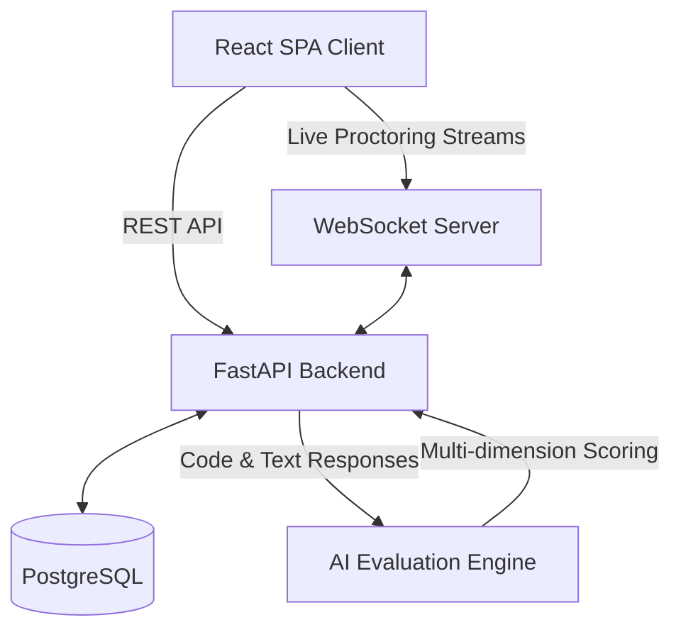

# 🚀 AssessAI — AI-Powered Technical Assessment Platform

<div align="center">
  
  
  
  
  
</div>

<br/>

**AssessAI** is an advanced, production-grade technical interview and candidate simulation platform. Designed with a premium, airy, SaaS-quality aesthetic, it empowers HR teams and technical recruiters to seamlessly administer coding challenges, multiple-choice questions, and written technical assessments with the backing of an AI-powered evaluation engine and real-time behavioral proctoring.

---

## 🌟 Key Features

- 🎭 **Role-Based Workflows**: Separate, secure access for `admin` (recruiters/HR) and `candidate` interfaces.
- 💻 **Integrated Code Environment**: Built-in Monaco Editor supporting Python, JavaScript, Java, and C++ execution.
- 👁️ **Live Proctoring & Telemetry**: WebSocket-based real-time tracking of candidate behavior (tab switches, copy/paste anomalies, webcam flags) fed directly to the Admin Dashboard.
- 🤖 **AI Evaluation Engine**: Deep, NLP-backed automated scoring assessing candidates on correctness, coding style, efficiency, and edge-case handling.
- 📊 **Beautiful Analytics**: Comprehensive visual reporting via Recharts, mapping candidate trends, test funnels, and module performance.
- 🛠️ **Visual Test Creator**: Drag-and-drop test module configuration with customizable strictness settings.

---

## 🏗️ Architecture

The platform utilizes a modern decoupled architecture:



- **[Frontend](./frontend/)**: React 18, TypeScript, Vite, Tailwind CSS, Zustand, React Query.
- **[Backend](./backend/)**: Python 3.12, FastAPI, SQLAlchemy 2.0, Alembic, Pydantic.
- **Infrastructure**: Configured for containerized deployment via Docker and orchestration via Kubernetes, with Prometheus tracking.

---

## 🚀 Quick Start (Docker)

The easiest way to run the entire AssessAI stack locally is via Docker Compose.

1. **Clone the repository**:
   ```bash
   git clone https://github.com/your-org/ai-simulation-engine.git
   cd ai-simulation-engine
   ```

2. **Set up environment variables**:
   Create a `.env` file in the root directory based on `.env.example` (or set up `.env` files in both frontend and backend).

3. **Launch the stack**:
   ```bash
   docker-compose up --build
   ```

4. **Access the application**:
   - Frontend UI: `http://localhost:3000`
   - Backend API Docs (Swagger): `http://localhost:8000/api/v1/docs`

---

## 💻 Manual Setup (Development)

If you prefer running the servers natively for development:

### 1. Backend Setup

For the backend, we recommend using **Python 3.12**. If your system's default `python3` is a newer pre-release version (like Python 3.14) or you have limited space on your primary system drive, we have provided an automated script `install_deps.sh` that uses Python 3.12 and redirects temporary compile/cache folders to the Kingston drive:

```bash
cd backend

# Option A: Recommended setup (especially for external drives / low system space)
# This script creates a Python 3.12 venv and installs dependencies using the Kingston drive for cache/temp files
chmod +x install_deps.sh
./install_deps.sh

# Option B: Standard setup (if your system has ample space and Python 3.12 is default)
python3 -m venv venv
./venv/bin/pip install -r requirements.txt

# Run database migrations (Ensure PostgreSQL is running and DATABASE_URL is configured in backend/.env)
./venv/bin/alembic upgrade head

# Start the FastAPI development server
./venv/bin/uvicorn app.main:app --reload --host 0.0.0.0 --port 8000
```
*Read the [Backend README](./backend/README.md) for detailed configuration.*

### 2. Frontend Setup

Since the project is hosted on an external drive, `npm` package installations must bypass symlink creation to prevent filesystem errors:

```bash
cd frontend

# Install dependencies with legacy peer deps and no-bin-links
npm install --legacy-peer-deps --no-bin-links

# Start the Vite React development server
npm run dev
```
*Read the [Frontend README](./frontend/README.md) for detailed configuration.*

---

## 🛠️ Troubleshooting (External/exFAT Drives)

If you are running the project from an external USB drive or SD card (e.g., `/Volumes/UNTITLED`) on macOS, you may encounter errors like `npm warn tar TAR_ENTRY_ERROR ENOENT: no such file or directory, lstat ...`. 

To fix this:
1. **Disable Bin Links**: Always use the `--no-bin-links` flag when running `npm install` (e.g., `npm install --legacy-peer-deps --no-bin-links`).
2. **Clear npm Cache**: If files are partially written or corrupted, run `npm cache clean --force` first.
3. **If errors persist**: Delete the `node_modules` directory (`rm -rf node_modules`) and run `npm install --legacy-peer-deps --no-bin-links` again.

---

## 🛡️ Security & Proctoring Details

AssessAI takes technical assessment integrity seriously. The platform employs a **Risk Score Matrix** powered by browser-side telemetry hooks (`useBehaviorTracker`) synchronized with the backend. 
If a candidate exceeds strictness thresholds (e.g., leaving the assessment window frequently), their test session is automatically flagged as "High Risk" and live alerts are pushed to active administrators.

---

## 📄 License

This project is proprietary and confidential. Unauthorized copying, distribution, or modification is strictly prohibited.
