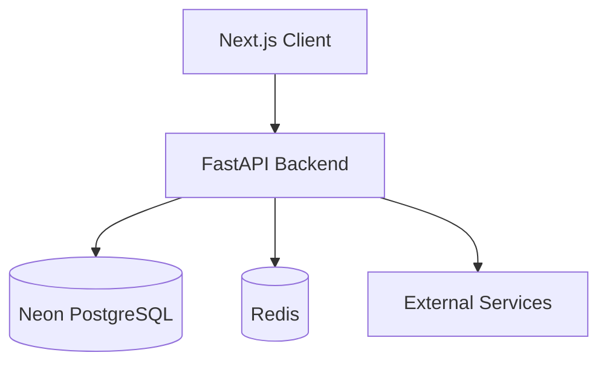

# CAPVIA Architecture

## System Architecture

## Folder Structure
- `api/`: API configurations and dependency injections.
- `routers/`: FastAPI endpoint routers.
- `services/`: Business logic implementations.
- `repositories/`: Database interaction patterns.
- `models/`: SQLAlchemy ORM models.
- `schemas/`: Pydantic models for validation.
- `frontend/`: Next.js 14 frontend application.
