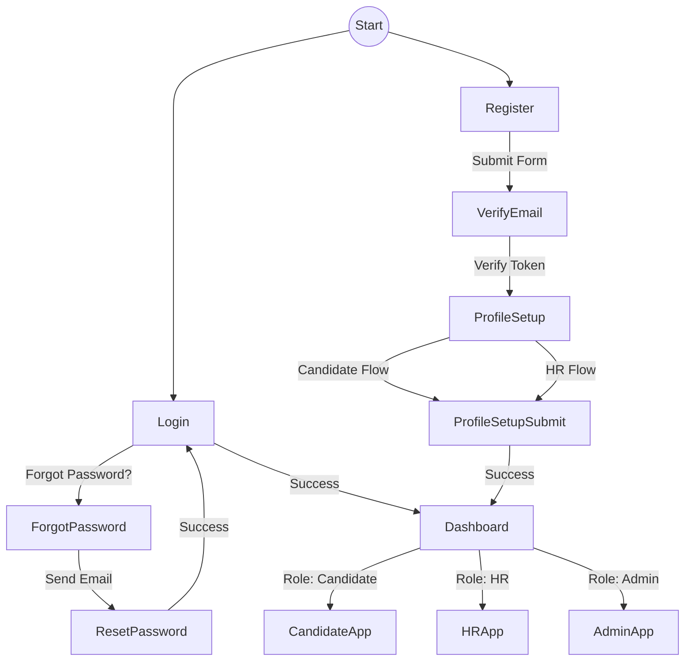

# CAPVIA Authentication Flow Diagram

The following represents the unified user journey through the CAPVIA authentication ecosystem. The backend determines the role dynamically, keeping the frontend flow simplified.

## Key Flows
1. **Registration Flow:** User fills out registration form -> Redirects to Verify Email -> Verifies -> Redirects to Profile Setup -> Redirects to Dashboard.
2. **Login Flow:** User enters credentials -> Authenticates -> Redirects to Dashboard (which routes based on backend Role).
3. **Recovery Flow:** Forgot Password -> Email sent -> Click link to Reset Password -> Login with new credentials.
