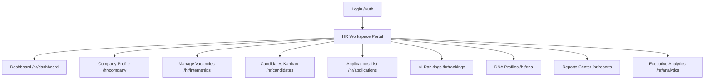

# HR Information Architecture

This document describes the routing, navigation hierarchy, and API data dependencies of the CAPVIA Recruiter platform.

---

## 1. Route Map & Navigation Tree

The Recruiter Workspace is organized into modular pages under the `/hr` route, ensuring clean bookmarking and native URL navigation:

---

## 2. Page & API Mappings

Each route relies on Tanstack React Query hooks calling the existing backend APIs:

| Path | Primary Hook / API | Purpose |
| :--- | :--- | :--- |
| `/hr/dashboard` | `internshipApi.list`, `recruitmentApi.getApplications` | Organisation KPI cards and recent activity timeline |
| `/hr/company` | `companyApi.listMine`, `companyApi.update` | Update organization details, industry, and branding |
| `/hr/internships` | `internshipApi.manage`, `internshipApi.create` | Manage listings, restore drafts, duplicate postings |
| `/hr/candidates` | `recruitmentApi.getApplications`, `applicationApi.updateStatus` | Kanban board drag-and-drop state transitions |
| `/hr/applications`| `recruitmentApi.getApplications` | Tabular search directory of candidates |
| `/hr/rankings` | `rankingsApi.getLeaderboard`, `rankingsApi.rerank` | Rerank cohorts, matrix comparison overlays, CSV exports |
| `/hr/reports` | `reportsApi.list`, `reportsApi.generate` | Access generated reports and trigger PDF downloads |
| `/hr/analytics` | `rankingsApi.getAnalytics` | Render funnel drop-offs and score distribution charts |
| `/hr/team` | `companyApi.getMembers`, `companyApi.addMember` | Invite and remove recruiters from organization seats |

---

## 3. Candidate Detail Drawer Sub-architectures

When selecting an application ID, a detailed slide-out drawer aggregates candidate data into 9 sub-panels:
1.  **Overview:** Rank stats, explainability strengths and telemetry flags.
2.  **Resume:** Sourced from `applicationDetail.resume_url` link.
3.  **ATS Analysis:** detect skill matches, semantic summary descriptions.
4.  **Simulation:** Code attempt execution summaries, compilation output.
5.  **Interview:** Verbal evaluation ratings, question history, and video downloads.
6.  **Integrity:** Look-aways count, tab switch logs, copy-paste count, trust levels.
7.  **DNA Profile:** capability dimensions plotted on a Recharts RadarChart.
8.  **Reports:** Export PDF report downloads.
9.  **Timeline:** Recalculation history and computation audit logs.
