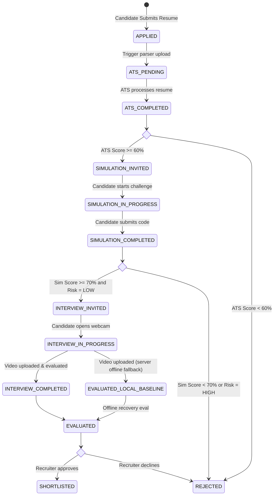
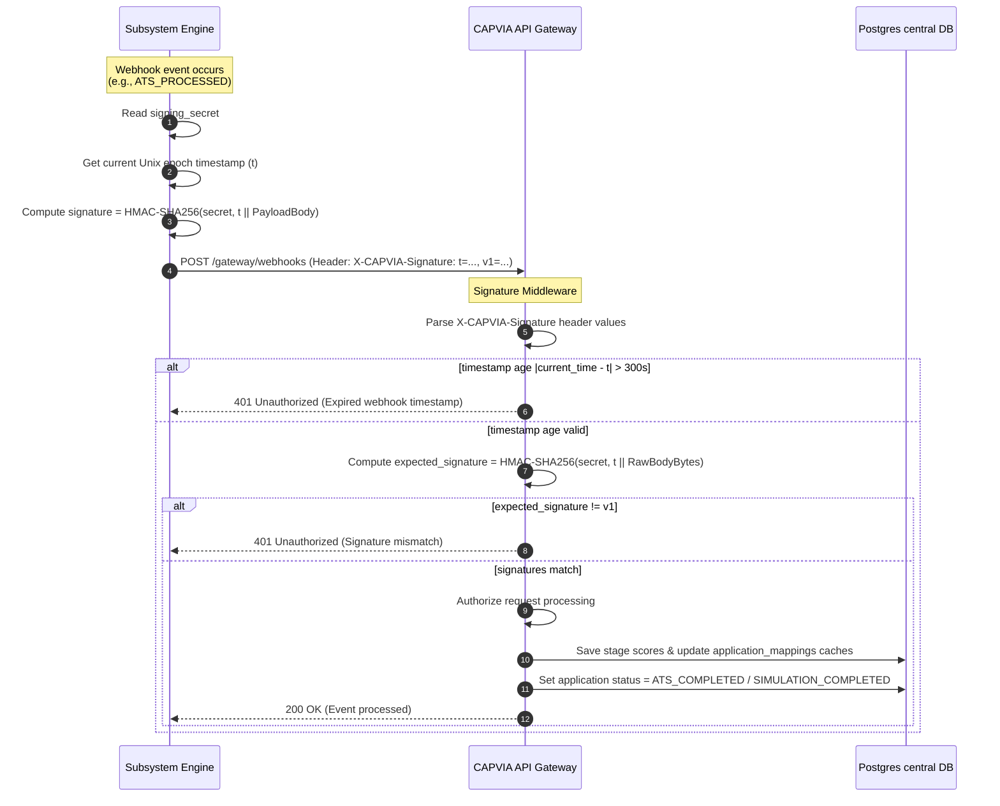
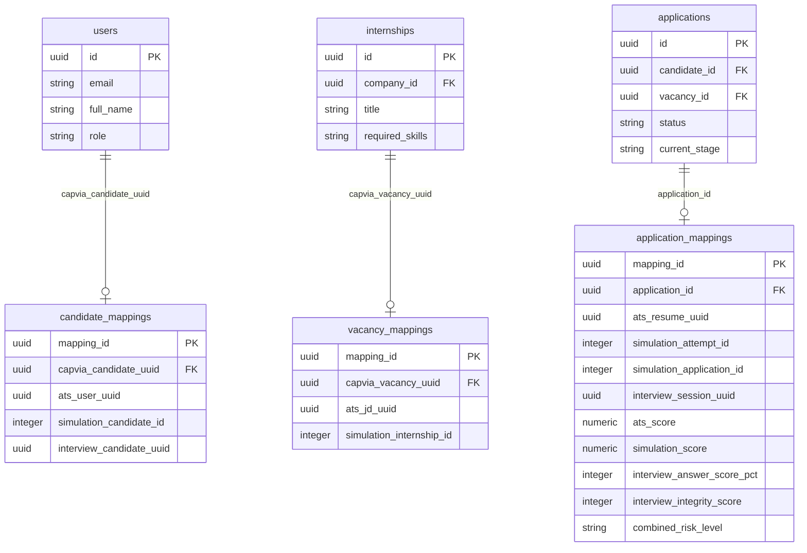

# CAPVIA Central Platform — Architectural Design

This document contains Mermaid diagrams illustrating the integration patterns, webhook signature verifications, and state machines of the CAPVIA recruitment workflow.

---

## 1. Candidate Lifecycle & State Machine

The flow diagram below displays the state machine transitions an applicant moves through, indicating threshold checks.

---

## 2. Webhook Signature Validation Sequence

The sequence diagram below displays the verification protocol between a subsystem sending a webhook event and CAPVIA Core validating its HMAC signature.

---

## 3. Data Mapping & Aggregation Schema

The entity mapping shows how the central `applications` entity aggregates identifiers from the ATS, Coding, and Interview subsystems via foreign key mapping tables.

