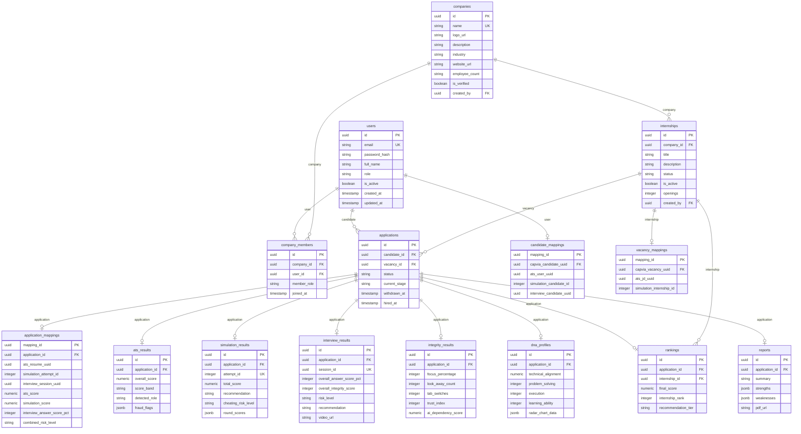

# Database Guide

This guide details the PostgreSQL database schema, table structures, column definitions, constraints, indexes, ERD diagrams, and administrative runbooks.

---

## 1. Entity Relationship Diagram (ERD)

The following diagram maps the structural relationships, foreign keys, and cardinalities of the CAPVIA schema:



---

## 2. Detailed Table Schemas

### 1. `users`
- **Purpose**: Stores authentication credentials, identity, and RBAC roles.
- **Constraints**:
  - `id`: Primary Key (UUID, generated via `uuid_generate_v4()`).
  - `email`: Unique Index, not null (varchar 255).
- **Indexes**:
  - `ix_users_email` (Unique, B-Tree).

### 2. `companies`
- **Purpose**: Recruiter organization profiles.
- **Constraints**:
  - `id`: Primary Key (UUID).
  - `name`: Unique Index, not null (varchar 255).
  - `created_by`: Foreign Key referencing `users.id` ON DELETE SET NULL.

### 3. `company_members`
- **Purpose**: Maps recruiters to their corporate organizations.
- **Constraints**:
  - `company_id`: Foreign Key referencing `companies.id` ON DELETE CASCADE.
  - `user_id`: Foreign Key referencing `users.id` ON DELETE CASCADE.

### 4. `internships`
- **Purpose**: Job postings and recruitment configuration constraints.
- **Constraints**:
  - `company_id`: Foreign Key referencing `companies.id` ON DELETE CASCADE.
  - `created_by`: Foreign Key referencing `users.id` ON DELETE SET NULL.

### 5. `applications`
- **Purpose**: Workflow instance for a candidate applying to a vacancy.
- **Constraints**:
  - `candidate_id`: Foreign Key referencing `users.id` ON DELETE CASCADE.
  - `vacancy_id`: Foreign Key referencing `internships.id` ON DELETE CASCADE.

### 6. `candidate_mappings`
- **Purpose**: Maps local User UUID to external subsystems (ATS User, Simulation Candidate ID, Interview Candidate).

### 7. `vacancy_mappings`
- **Purpose**: Maps local Internship UUID to external subsystems (ATS JD UUID, Simulation Internship ID).

### 8. `application_mappings`
- **Purpose**: Core mapping bridging local applications, remote resume uploads, test attempts, and video interview sessions.

### 9. `ats_results`, `simulation_results`, `interview_results`
- **Purpose**: Standardize score extraction from webhooks.
- **Constraints**:
  - `application_id`: Unique Foreign Key referencing `applications.id` ON DELETE CASCADE (forces 1-to-1 matching).

### 10. `integrity_results`
- **Purpose**: Stores detailed proctoring metrics and calibrated Trust Indexes.

### 11. `dna_profiles`
- **Purpose**: Maps the 9 core dimensions and SBERT semantic embeddings.

### 12. `rankings`
- **Purpose**: Tracks composite scoring contributions, local percentiles, and recommendation tiers.

### 13. `reports`
- **Purpose**: Metadata of compiled PDF report files.

---

## 3. SQL Query Examples

### Recruiter Leaderboard Query
```sql
SELECT 
    r.internship_rank,
    u.full_name,
    r.final_score,
    r.recommendation_tier,
    i.trust_index,
    d.problem_solving,
    d.execution
FROM rankings r
JOIN applications a ON r.application_id = a.id
JOIN users u ON a.candidate_id = u.id
LEFT JOIN integrity_results i ON a.id = i.application_id
LEFT JOIN dna_profiles d ON a.id = d.application_id
WHERE r.internship_id = 'your-internship-uuid-here'
ORDER BY r.final_score DESC, i.trust_index DESC;
```

### Funnel Analytics Query
```sql
SELECT 
    status, 
    COUNT(*) as candidates_count
FROM applications
WHERE vacancy_id = 'your-internship-uuid-here'
GROUP BY status;
```

---

## 4. Backup & Disaster Recovery Runbook

### Scheduled Backups (Cron Runbook)
Run a nightly backup of the PostgreSQL database using `pg_dump`:
```bash
pg_dump -h localhost -U postgres -d capvia_dev_db -F c -b -v -f "/var/backups/capvia/capvia_db_$(date +%F).dump"
```

### Full Restore Script
In the event of database corruption or hardware failure:
```bash
# 1. Terminate all active database connections
psql -d postgres -c "SELECT pg_terminate_backend(pid) FROM pg_stat_activity WHERE datname = 'capvia_dev_db';"

# 2. Re-create the database
dropdb capvia_dev_db
createdb capvia_dev_db

# 3. Restore schema & records from the dump file
pg_restore -h localhost -U postgres -d capvia_dev_db -v "/var/backups/capvia/capvia_db_backup_file.dump"
```
