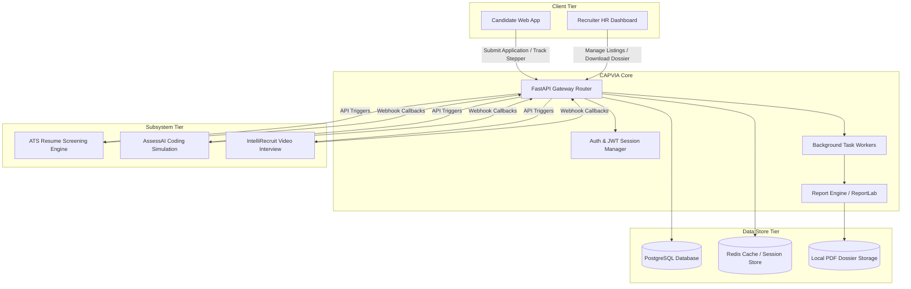
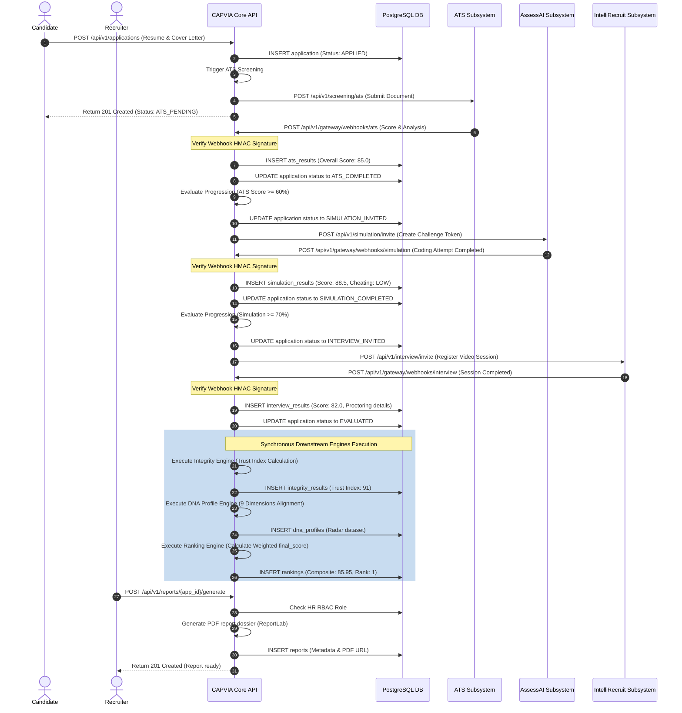
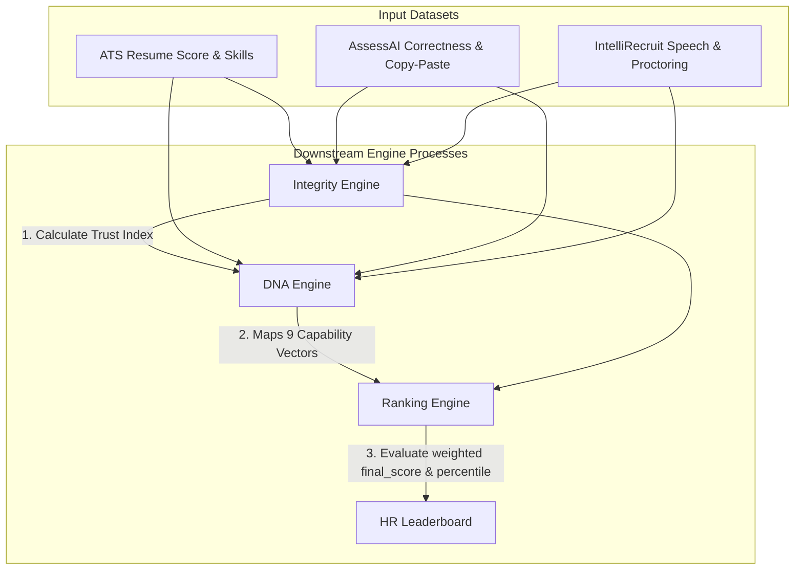

# System Architecture

This document outlines the core architecture, component interactions, sequence diagrams, and lifecycle transitions of the CAPVIA recruitment platform.

---

## 1. System Topology

CAPVIA is structured as an API Gateway and recruitment control center, coordinating asynchronous evaluations across three external specialized microservice subsystems (ATS, Simulation, and Interview).

---

## 2. Platform Sequence Diagram

The following diagram illustrates the candidate registration, application submission, screening webhooks, and downstream engines processing lifecycle:

---

## 3. Downstream Calculations Chain

When the `INTERVIEW_COMPLETED` webhook fires and results are committed, the **Downstream Engines Chain** executes to evaluate capabilities, compliance, and standings:

### Downstream Calculations Formulae
1. **Integrity Engine**:
   - Calculates the **Trust Index** ($TI \in [0, 100]$):
     $$TI = 100 - (TabSwitches \times 5) - (LookAwayCount \times 2) - (CopyPasteEvents \times 10)$$
     *(Proctoring indicators are calibrated dynamically against baseline metrics).*
2. **DNA Profile Engine**:
   - Compiles a 9-dimensional capability score ($0-100$) based on semantic alignment, coding proficiency, speech parameters, and integrity metrics.
3. **Ranking Engine**:
   - Evaluates the **Final Score** ($FS \in [0, 100]$):
     $$FS = (ATS \times 0.25) + (Simulation \times 0.30) + (Interview \times 0.25) + (TrustIndex \times 0.20)$$
   - Computes dynamic percentiles and assigns recommendation tiers (Platinum, Gold, Silver, Bronze).
